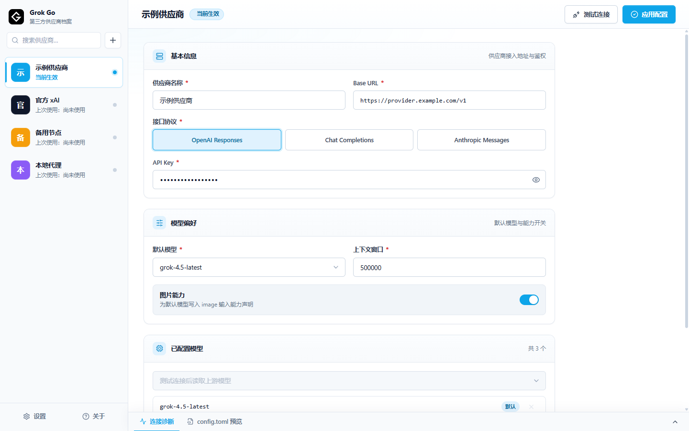

# Grok Go

Grok Go 是一个面向 Windows 的 Grok Build 第三方供应商配置切换器。它可以保存多个供应商档案，测试模型列表，并安全改写 `~/.grok/config.toml`。



## 功能

- 管理多个供应商档案，支持搜索、导入和导出。
- 支持 OpenAI Responses、OpenAI Chat Completions 和 Anthropic Messages。
- 从供应商 `/models` 接口读取模型，也允许手动添加模型。
- 为每个档案配置默认模型、上下文窗口、图片能力和模型列表。
- 应用配置前创建 `config.toml.bak`，支持一键恢复。
- 检测配置文件被外部修改，避免静默覆盖。
- 可选本地协议兼容模式，修复已确认的 Responses 和 Messages 流事件兼容问题，同时保留工具调用事件。

## 下载与运行

普通用户推荐下载 `Grok-Go-1.6.3-Setup-x64.exe`，按安装向导完成安装。安装程序会创建桌面和开始菜单快捷方式，后续安装新版时会覆盖更新程序文件，同时保留供应商档案。

需要免安装运行时，可以下载 `Grok-Go-1.6.3-win-x64.zip`。请先完整解压 ZIP，再运行其中的 `Grok Go.exe`；不要只复制单独的 EXE 文件。

Windows 可能提示“未知发布者”，因为当前版本尚未购买代码签名证书。请仅从本仓库的 Release 页面下载，并使用 Release 中的 `SHA256SUMS.txt` 核对文件哈希。

首次启动时，程序会尝试导入现有 `~/.grok/config.toml`；如果文件不存在，则创建一个空白档案。配置切换只影响之后启动的新 Grok 会话。

## 基本使用

1. 新建或选择供应商档案。
2. 填写供应商名称、Base URL 和 API Key。
3. 选择接口协议并点击“测试连接”。
4. 添加需要写入配置的模型，并选择默认模型。
5. 点击“应用配置”。原配置会备份为 `config.toml.bak`。

部分 Anthropic 兼容供应商不提供 `/models`，可以手动添加模型后确认强制应用。

## 协议兼容模式

部分第三方兼容接口会返回 Grok Build 无法解析的流事件。为对应档案开启“协议兼容模式”后，Grok Go 会：

- 在本机启动 `127.0.0.1:8787` 代理；
- 将对应模型的 `base_url` 写为 `http://127.0.0.1:8787/v1`；
- 对 Anthropic Messages 过滤 thinking 块，并保留 `tool_use`、工具名和 `input_json_delta`；
- 对 OpenAI Responses 只过滤缺少 `sequence_number` 的 synthetic 空首帧，并保留函数调用事件和原始序号；
- 窗口关闭后驻留系统托盘，避免代理中断。

兼容模式只应用经过验证的精确规则。它不会补造工具名、调用 ID、参数或事件序号，也不会自动修复乱序、鉴权失败、模型不存在和上游中断。

要彻底退出，请在系统托盘菜单中选择“退出并停止本地代理”。

## 安全说明

供应商档案保存在 `%APPDATA%\grok-config-switcher\profiles.json`，其中 API Key 为明文。导出的 JSON 同样包含明文 API Key，请勿上传到代码仓库、网盘或公开聊天。

本仓库和 Release 构建不包含任何用户档案、真实 API Key、`config.toml` 或备份文件。安全问题请参阅 [SECURITY.md](SECURITY.md)。

## 本地开发

需要 Node.js 22 和 pnpm 10：

```powershell
pnpm install --frozen-lockfile
pnpm dev
```

测试和构建：

```powershell
pnpm test
pnpm run typecheck
pnpm run build
pnpm run dist
```

正式构建会输出安装程序和 ZIP 解压版：

```text
release/Grok-Go-1.6.3-Setup-x64.exe
release/Grok-Go-1.6.3-win-x64.zip
```

## 参与贡献

请先阅读 [CONTRIBUTING.md](CONTRIBUTING.md)。项目使用 MIT 许可证。
